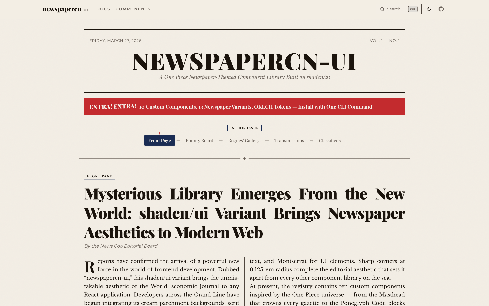

# newspapercn-ui

A [shadcn/ui](https://ui.shadcn.com) variant with a One Piece newspaper theme — **Grand Line Gazette**.

Cream parchment backgrounds, serif typography, sharp editorial corners, navy/sepia/red accent colors. Inspired by the World Economic Journal from One Piece.

[Live Demo](https://newspapercn-ui.vercel.app) | [Registry](https://newspapercn-ui.vercel.app/r/registry.json)



## Quick Start

Install the theme into any existing shadcn/ui project:

```bash
npx shadcn@latest add https://newspapercn-ui.vercel.app/r/newspaper-theme.json
```

Then add font imports to your root layout:

```tsx
import "@fontsource-variable/playfair-display";
import "@fontsource/libre-baskerville";
import "@fontsource/libre-baskerville/700.css";
import "@fontsource/libre-baskerville/400-italic.css";
import "@fontsource-variable/montserrat";
```

## Available Components

All components are installable via the shadcn CLI:

```bash
npx shadcn@latest add https://newspapercn-ui.vercel.app/r/<component>.json
```

| Component | Description |
|-----------|-------------|
| `newspaper-theme` | Full theme — OKLCH color tokens, fonts, base styles (light + dark) |
| `theme-toggle` | Light/dark mode toggle with Sun/Moon icons |
| `masthead` | Newspaper header with title, date, volume/issue, double-rule borders |
| `wanted-poster` | One Piece wanted poster bounty card with parchment texture |
| `headline-banner` | "BIG NEWS!" alert banner with severity levels |
| `column-layout` | Multi-column newspaper grid with rules and drop caps |
| `news-coo-badge` | Notification badge with News Coo bird silhouette |

## Theme

**"Grand Line Gazette"** — classic newspaper dignity + One Piece color pops.

- **Light mode:** Cream parchment, dark ink text, warm sepia accents
- **Dark mode:** Warm dark brown newsprint, cream text
- **Primary:** Deep navy (Marine blue)
- **Accent:** Bold red ("BIG NEWS!")
- **Fonts:** Playfair Display (headings), Libre Baskerville (body), Montserrat (UI)
- **Radius:** 0.125rem (sharp editorial corners)

### Newspaper Component Variants

Base shadcn components include newspaper-specific variants:

- **Button** — `accent` (red CTA), `newspaper` (editorial serif link)
- **Badge** — `section` (all-caps underlined), `breaking` (pulsing red)
- **Card** — `article` (left border accent), `featured` (top border accent)
- **Alert** — `breaking` (red bg, rotated title), `correction` (amber, italic)
- **Separator** — `thick`, `double`, `dashed`, `ornamental` (centered flourish)
- **Input** — `editorial` (bottom-border only, serif)
- **Textarea** — `letter` (lined-paper effect, serif)

## Development

```bash
git clone https://github.com/pyaephyowinn/newspapercn-ui.git
cd newspapercn-ui
pnpm install
pnpm dev
```

### Commands

```bash
pnpm dev              # Start dev server
pnpm build            # Production build
pnpm registry:build   # Generate installable registry JSON
```

## License

MIT
